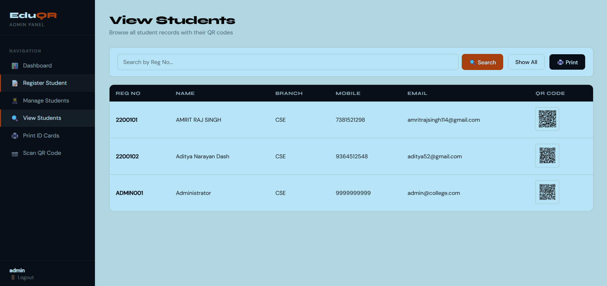
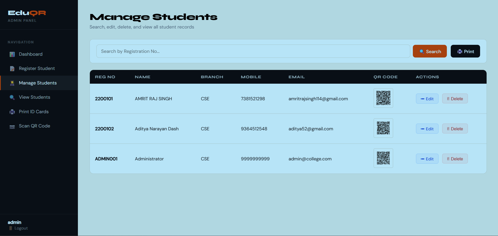
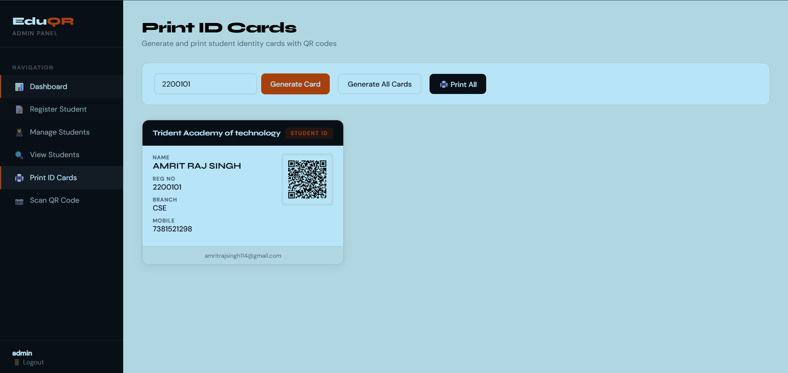

<div align="center">

<h1>📋 EduQR</h1>
<h3>Student Registration & QR Management System</h3>

<p>
  
  
  
  
  
  
</p>

<p>A web-based student management system that lets admins register students,<br/>auto-generate QR codes, scan them live via webcam, and print ID cards — all in one place.</p>

<br/>

> 🏫 **B.Tech Project** · Computer Science & Information Technology · Trident Academy of Technology, Bhubaneswar

</div>

---

## 📑 Table of Contents

- [About](#-about)
- [Features](#-features)
- [Screenshots](#-screenshots)
- [Project Structure](#-project-structure)
- [Database Setup](#-database-setup)
- [Prerequisites](#-prerequisites)
- [Getting Started](#-getting-started)
- [How the QR System Works](#-how-the-qr-system-works)
- [How Student Registration Works](#-how-student-registration-works)
- [Access Control](#-access-control)
- [Libraries Used](#-libraries-used)
- [Troubleshooting](#-troubleshooting)
- [Author](#-author)

---

## 🧠 About

I built **EduQR** as my Advanced Java semester project. The problem I wanted to solve was simple — managing student ID cards manually in college is slow and error-prone.

So I created a complete system where:
- 👨‍💼 **Admin** registers students → system auto-generates a unique QR code → stored as BLOB in Oracle DB
- 👨‍🎓 **Student** logs in to view their own profile and QR code
- 📷 **Anyone** can scan a QR code using a webcam and instantly get the student's full details
- 🖨️ **ID cards** can be generated and printed directly from the browser

---

## ✨ Features

- 🔐 **Role-based login** — separate dashboards for Admin and Students
- 👤 **Student registration** — stores name, branch, mobile, email, and reg. number
- 📲 **QR Code generation** — each student gets a unique QR code via ZXing
- 💾 **QR caching** — QR images stored as BLOBs in Oracle DB, no re-generation needed
- 📷 **Live QR Scanner** — webcam-based scanning using `html5-qrcode`
- 🖨️ **ID card printing** — print professional student ID cards directly from the browser
- 📊 **Admin dashboard** — live stats + branch-wise breakdown with doughnut chart
- ✏️ **Edit / Delete students** — full CRUD from the manage screen
- 🗑️ **Quick Delete** — delete students directly from the admin dashboard
- 🔒 **Session guard** — every protected page checks session, redirects to login if not authenticated

---

## 📸 Screenshots

### 🔍 View Students — Browse all records with QR codes



---

### 👨‍🎓 Manage Students — Search, Edit and Delete



---

### 🖨️ Print ID Cards — Generate student identity cards



---

## 🗂️ Project Structure

```
StudentRegistrationQR/
│
├── src/
│   └── main/
│       ├── java/
│       │   └── stud/
│       │       └── ShowQRImageServlet.java   → Servlet that reads QR BLOB and serves it as PNG
│       │
│       └── webapp/
│           ├── META-INF/
│           │
│           ├── WEB-INF/
│           │   ├── web.xml                   → Deployment descriptor (Jakarta EE 6.0)
│           │   └── lib/
│           │       ├── core-2.2.jar          → ZXing core (QR engine)
│           │       ├── javase-3.5.3.jar      → ZXing image utilities
│           │       └── ojdbc14.jar           → Oracle JDBC driver
│           │
│           ├── index.jsp             → Landing / home page with role selection
│           ├── login.jsp             → Login screen (Admin & Student)
│           ├── loginaction.jsp       → Handles login form, creates session
│           ├── register.jsp          → Student creates their login account
│           ├── logout.jsp            → Destroys session and redirects to login
│           ├── home.jsp              → Smart redirect → Admin or Student dashboard
│           │
│           ├── adminDashbord.jsp     → Admin dashboard (stats, chart, recent students, delete)
│           ├── reg.jsp               → Admin registers a new student
│           ├── generateQR.jsp        → Generates QR code image and saves BLOB to DB
│           ├── manageStudent.jsp     → Search / Edit / Delete students
│           ├── viewStudent.jsp       → View all students with QR thumbnails
│           ├── editStudent.jsp       → Edit individual student details
│           ├── printID.jsp           → Printable student ID cards
│           ├── readQR.jsp            → Webcam-based QR code scanner
│           ├── getStudent.jsp        → AJAX endpoint — returns student data from scanned QR
│           └── studentDashbord.jsp   → Student's personal profile + QR code view
│
├── build/                            → Compiled output (auto-generated, do not edit)
├── .settings/                        → Eclipse IDE project settings
├── .classpath                        → Eclipse classpath configuration
└── .gitignore                        → Git ignore rules
```

---

## 🗃️ Database Setup

Two tables are required. Run these **in order** in Oracle SQL\*Plus or SQL Developer:

### `student_qr` — stores student records and QR images

```sql
CREATE TABLE student_qr (
    regno     VARCHAR2(20)   PRIMARY KEY,
    name      VARCHAR2(100)  NOT NULL,
    branch    VARCHAR2(20),
    mobile    VARCHAR2(20),
    email     VARCHAR2(60),
    qr_data   VARCHAR2(500),
    qr_image  BLOB
);
```

### `qr_users` — stores login credentials for Admin and Students

```sql
CREATE TABLE qr_users (
    username  VARCHAR2(50)   PRIMARY KEY,
    password  VARCHAR2(50)   NOT NULL,
    regno     VARCHAR2(20)   NOT NULL,
    role      VARCHAR2(10)   NOT NULL,
    cname     VARCHAR2(100),
    CONSTRAINT fk_users_regno
        FOREIGN KEY (regno) REFERENCES student_qr(regno)
);
```

> ⚠️ Always insert into `student_qr` **first**, then `qr_users` — because of the foreign key constraint.

### Insert the default Admin account

```sql
-- Step 1: Admin student record (MUST be first)
INSERT INTO student_qr (regno, name, branch, mobile, email)
VALUES ('ADMIN001', 'Administrator', 'CSE', '9999999999', 'admin@college.com');
COMMIT;

-- Step 2: Admin login account
INSERT INTO qr_users (username, password, regno, role, cname)
VALUES ('admin', 'admin123', 'ADMIN001', 'ADMIN', 'Trident Academy of Technology');
COMMIT;
```

### Column Reference

| Column | Table | Description |
|--------|-------|-------------|
| `regno` | student_qr | Registration number (Primary Key) |
| `qr_image` | student_qr | Cached QR code stored as BLOB |
| `role` | qr_users | Either `ADMIN` or `STUDENT` |
| `cname` | qr_users | College / institution name |

---

## ⚙️ Prerequisites

| Requirement | Version / Notes |
|-------------|-----------------|
| ☕ JDK | 17 or higher |
| 🐱 Apache Tomcat | **10+** (uses `jakarta.servlet`, not `javax`) |
| 🗄️ Oracle XE | Running on `localhost:1521`, SID `xe` |
| 🔑 DB Credentials | Default: `system / system` |
| 💻 Eclipse IDE | Enterprise Java Developers edition |

---

## 🚀 Getting Started

### 1. Set up the database

Start Oracle XE and run the SQL above to create both tables and the admin account.

### 2. Import into Eclipse

1. Open **Eclipse IDE for Enterprise Java Developers**
2. **File → Import → Existing Projects into Workspace**
3. Browse to the `StudentRegistrationQR` folder → **Finish**
4. Confirm all JARs in `WEB-INF/lib/` are on the Build Path

### 3. Configure Tomcat

1. **Window → Preferences → Server → Runtime Environments**
2. **Add → Apache Tomcat v10.1** → point to your Tomcat folder → **Finish**

### 4. Run the project

Right-click project → **Run As → Run on Server** → Select Tomcat 10.1 → **Finish**

### 5. Open in browser

```
http://localhost:9091/StudentRegistrationQR/
```

### Default Login

| Role | Username | Password |
|------|----------|----------|
| 👨‍💼 Admin | `admin` | `admin123` |
| 👨‍🎓 Student | *(register first)* | *(set during registration)* |

---

## 🔌 Changing DB Credentials

The DB connection is hardcoded. If your Oracle setup is different, update this block in all JSPs and the Servlet:

```java
Class.forName("oracle.jdbc.driver.OracleDriver");
con = DriverManager.getConnection(
    "jdbc:oracle:thin:@localhost:1521:xe", "system", "system");
```

Files to update: `ShowQRImageServlet.java`, `loginaction.jsp`, `register.jsp`, `adminDashbord.jsp`, `manageStudent.jsp`, `generateQR.jsp`, and any other JSP that connects to the DB.

---

## 🧑‍💻 How the QR System Works

```
Admin fills the student registration form (reg.jsp)
                    ↓
generateQR.jsp builds a text string:
"RegNo: 2200101 | Name: Amrit | Branch: CSE | Mobile: 9999 | Email: a@b.com"
                    ↓
ZXing encodes it into a 250×250 PNG image
                    ↓
Image saved as BLOB in student_qr table (qr_image column)
                    ↓
ShowQRImageServlet serves it via:
/ShowQRImageServlet?regno=2200101
                    ↓
If BLOB is NULL → servlet regenerates QR on-the-fly and saves it back to DB
```

---

## 👤 How Student Registration Works

> This is a **two-step process** — important to understand before testing:

```
┌─────────────────────────────────────────────────────────┐
│  STEP 1 — Admin side  (reg.jsp)                         │
│                                                         │
│  Admin enters: Reg No, Name, Branch, Mobile, Email      │
│  ✅ Record saved to student_qr + QR code BLOB generated  │
└─────────────────────────────────────────────────────────┘
                          ↓
┌─────────────────────────────────────────────────────────┐
│  STEP 2 — Student side  (register.jsp)                  │
│                                                         │
│  Student enters their Reg No + creates a password       │
│  ✅ System checks Reg No exists → saves to qr_users     │
└─────────────────────────────────────────────────────────┘
                          ↓
            ✅ Student can now login at login.jsp
```

> ⚠️ A student **cannot login** until Admin registers them in Step 1.

---

## 🔒 Access Control

| Role | Access |
|------|--------|
| `ADMIN` | Full access — manage students, generate QR, print IDs, delete records |
| `STUDENT` | Own dashboard only — view personal info and QR code |
| Not logged in | Redirected to `login.jsp` from every protected page |

---

## 📦 Libraries Used

| Library | Version | Purpose |
|---------|---------|---------|
| [ZXing Core](https://github.com/zxing/zxing) | 2.2 | QR code generation engine |
| ZXing JavaSE | 3.5.3 | PNG image rendering for QR |
| Oracle JDBC | ojdbc14 | Oracle DB connectivity |
| [html5-qrcode](https://github.com/mebjas/html5-qrcode) | CDN | Webcam-based QR scanning |
| [Chart.js](https://www.chartjs.org/) | CDN | Branch distribution doughnut chart |
| [Google Fonts](https://fonts.google.com/) | CDN | Syne + DM Sans typography |

---

## 🐞 Troubleshooting

<details>
<summary><b>🔴 ClassNotFoundException: oracle.jdbc.driver.OracleDriver</b></summary>

Make sure `ojdbc14.jar` is present inside `WEB-INF/lib/` and is added to the project Build Path in Eclipse.
</details>

<details>
<summary><b>🔴 404 error after deploying</b></summary>

Wait 10–15 seconds for Tomcat to finish deploying. Then refresh the browser. Also check the Tomcat console for any startup errors.
</details>

<details>
<summary><b>🔴 QR code image not showing</b></summary>

Make sure the student was registered through `reg.jsp` (not inserted manually via SQL). If inserted via SQL, the `qr_image` BLOB will be NULL — the servlet will auto-generate it on first access.
</details>

<details>
<summary><b>🔴 "No student found" on Print ID Cards page</b></summary>

This happens when a student exists in `student_qr` but has no login account in `qr_users`. Fixed by changing the SQL query from `INNER JOIN` to `LEFT JOIN`.
</details>

<details>
<summary><b>🔴 jakarta.servlet.* errors on startup</b></summary>

You are using Tomcat 9 or below. This project requires **Tomcat 10+** because it uses the `jakarta.servlet` package (not the old `javax.servlet`).
</details>

<details>
<summary><b>🔴 ORA-00001: unique constraint violated</b></summary>

You are trying to insert a record that already exists. Check with `SELECT * FROM student_qr` or `SELECT * FROM qr_users` before inserting again.
</details>

---

## 👨‍💻 Author

**Amrit Raj Singh**
B.Tech — Computer Science & Information Technology
Trident Academy of Technology, Bhubaneswar, Odisha

[](https://github.com/Amrit114)
[](mailto:singhamritraj898@gmail.com)

> *"Built this to actually understand how Java EE works in practice — JSP, Servlets, JDBC, session management, and Oracle BLOB storage all together. Took a while but learned a lot."*

---

## 📄 License

This project is for educational purposes. Feel free to use, modify, and learn from it.

---

<div align="center">

⭐ **If this helped you, give it a star on GitHub!** ⭐

Made with ❤️ and a lot of ☕

</div>
